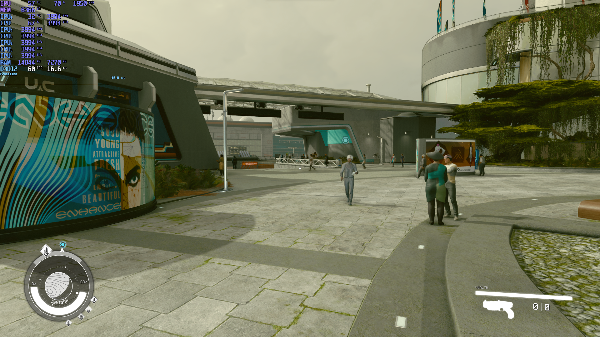

# STAFRIELD OPTIMISED GRAPHICS

## HOW TO USE

Head to ```"%USERPROFILE% \ Documents \My Games\Starfield\"``` and copy and paste the "starfieldPrefs.ini" file there

IF YOU USE MOD ORGANISER GO TO  ```"\AppData\Local\ModOrganizer\Starfield\profiles\Default"``` and paste the file there

## SYSTEM SPECIFICATIONS


CPU : Intel core i5 12400F

GPU : Nvidea RTX 3060 12GB VRAM

RAM : 2x Corsair CM4X8GD3000C15K4 8GB DDR4 1066 MHz

Before making these optimisations my framarate would sit between 40-45 FPS and the frametime was very inconsistent causing laggy, slow and unresponsive gameplay.

## THE GOAL

The purpose of this config was to keep the framerate near enough glued to 60FPS while keeping a consistant frametime without sacrificing graphical quality.

## THE RESULTS

I was able to keep the FPS consistently on 60 with occasional drops to around 57FPS

# COMPARISION

### ULTRA SETTINGS


### CUSTOM CONFIG


### ULTRA SETTINGS


### CUSTOM CONFIG


### ULTRA SETTINGS


### CUSTOM CONFIG


